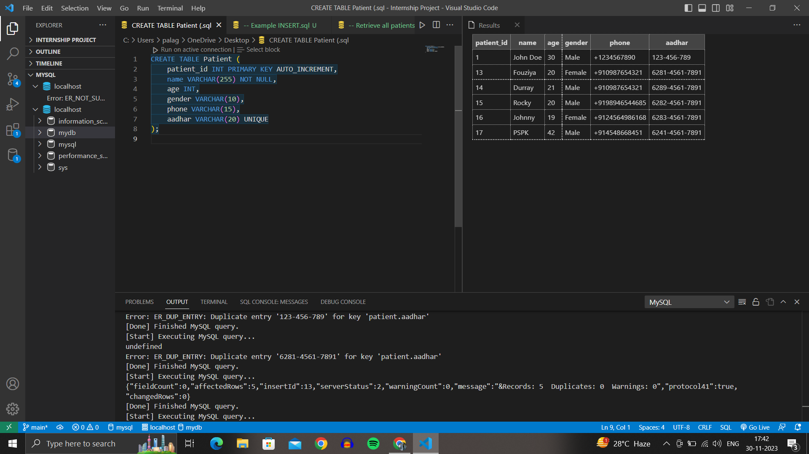
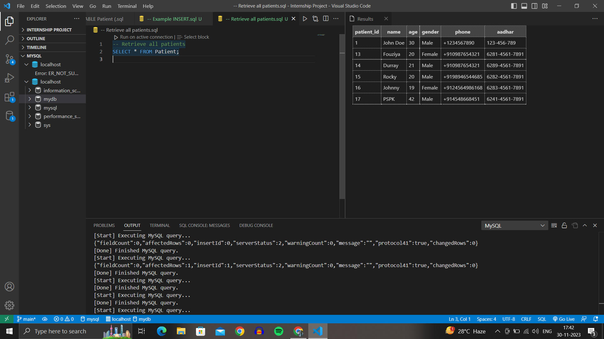
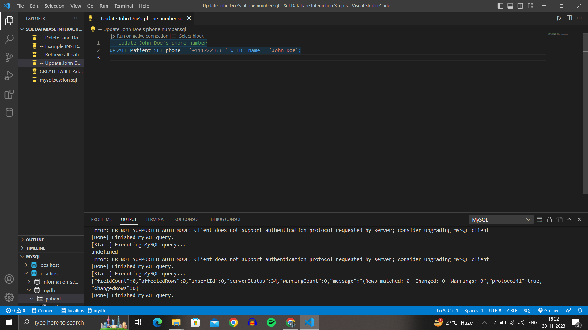
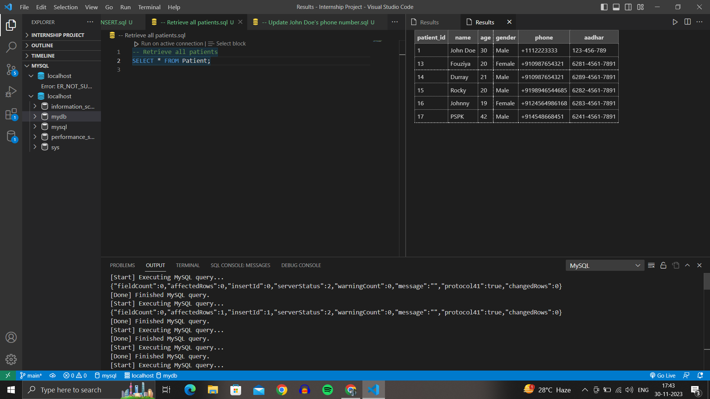
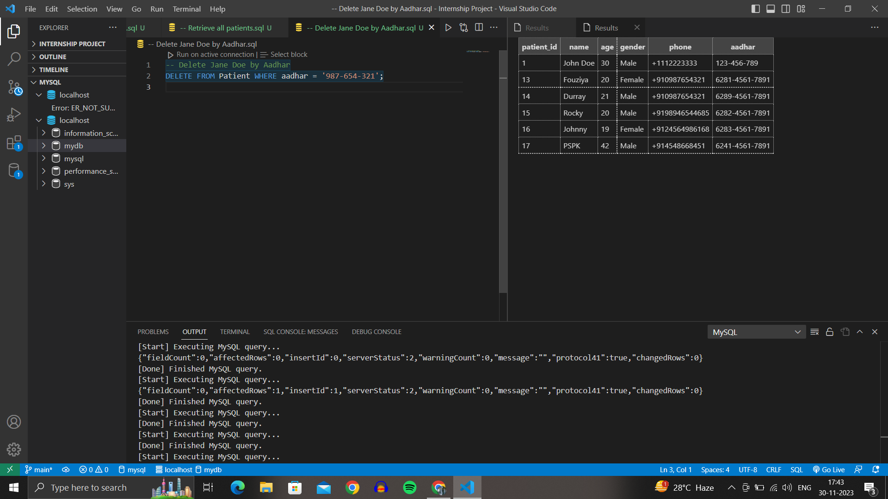
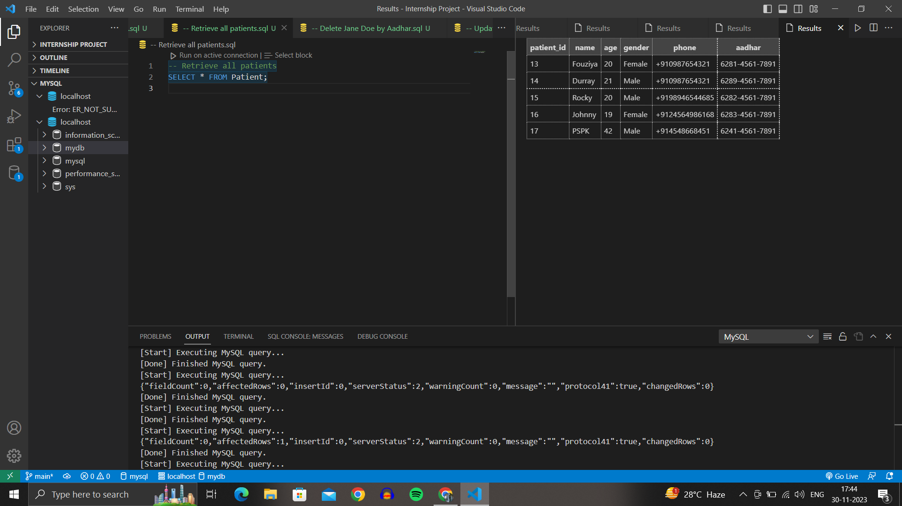

# SQL Database Interaction Scripts

## Objective

This repository contains SQL scripts for storing and retrieving patient data. The primary objectives are to develop INSERT, SELECT, UPDATE, and DELETE operations and to test these operations with a mock SQL database.

## Requirements

- Develop SQL scripts for the following operations:
  - INSERT: Add patient data to the database.
  - SELECT: Retrieve patient data from the database.
  - UPDATE: Modify patient data in the database.
  - DELETE: Remove patient data from the database.

- Test these operations with a mock SQL database with the following schema:
  - Patient table with columns: patient_id, name, age, gender, phone, and Aadhar.

## Usage

1. **Database Schema:**

   Ensure that your database schema matches the following:

   ```sql
   CREATE TABLE Patient (
       patient_id INT PRIMARY KEY AUTO_INCREMENT,
       name VARCHAR(255) NOT NULL,
       age INT,
       gender VARCHAR(10),
       phone VARCHAR(15),
       aadhar VARCHAR(20) UNIQUE
   );
*

# OUTPUT : 



## SQL Operations:

**INSERT Operation :**
**-- Example INSERT**
```sql
INSERT INTO Patient (name, age, gender, phone, aadhar)
VALUES ('John Doe', 30, 'Male', '+1234567890', '123-456-789');
```

# OUTPUT : 


**SELECT Operation :**
-- Retrieve all patients
```sql
SELECT * FROM Patient; 
```
# OUTPUT : 



**UPDATE Operation:**

-- Update patient's phone number
```sql
UPDATE Patient SET phone = '+9876543210' WHERE aadhar = '123-456-789';
```

# OUTPUT : 


# OUTPUT 2 :


**DELETE Operation:**

-- Delete a patient by Aadhar
```sql
DELETE FROM Patient WHERE aadhar = '123-456-789';
```
# OUTPUT : 


# OUTPUT 2 :


# FINAL OUTPUT : 



**Testing:**

Execute the SQL scripts in the specified order to perform the CRUD operations.
Verify the results by running SELECT queries and checking the database state.
Additional Information
Database System Compatibility:

Ensure your database system supports the SQL syntax used in these scripts.
Data Customization:

Adjust the data values and queries based on your specific requirements.